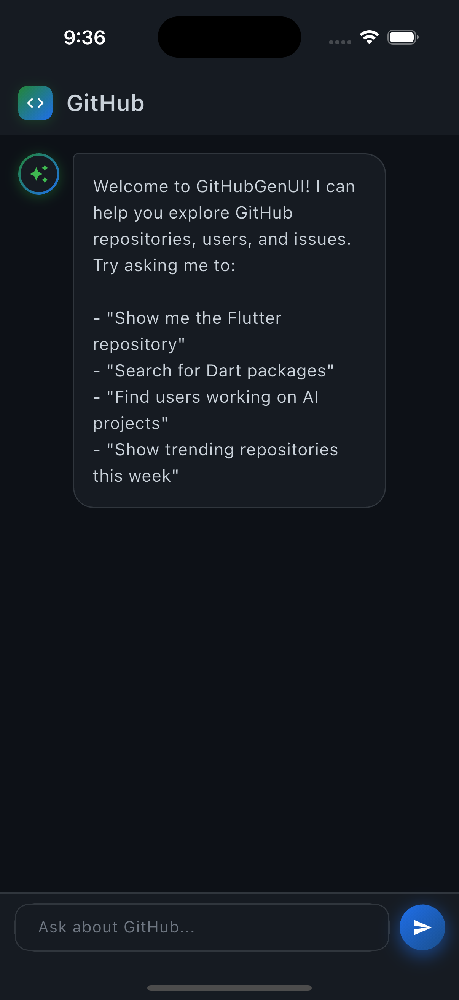

# GitHub GenUI

A Flutter app that uses [GenUI](https://github.com/flutter/genui) to dynamically generate GitHub-browsing interfaces via AI. Chat with the AI to explore public GitHub repositories, users, and issues. The AI responds with either text or dynamically-generated Flutter widgets.



## Setup

### Get a Gemini API Key

1. Go to [Google AI Studio](https://aistudio.google.com/apikey)
2. Sign in with your Google account
3. Click "Create API Key"
4. Copy the key

### Configure the App

Create a file `lib/api_key.dart` with your API key:

```dart
const geminiApiKey = 'YOUR_API_KEY_HERE';
```

This file is gitignored to keep your key safe.

## Run

```bash
flutter pub get
flutter run
```

## Requirements

- Flutter >= 3.35.7
- Dart >= 3.8.0
